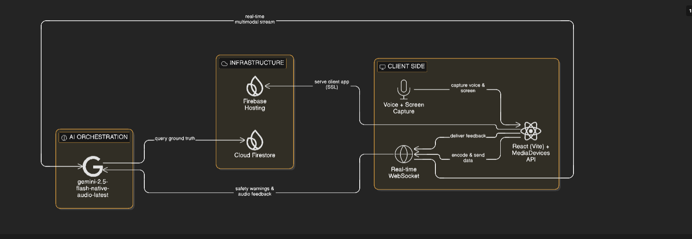

# Beacon: Multimodal AI UI Navigator 🎙️

**Beacon** is a real-time, vision-enabled AI agent designed to revolutionize warehouse operations. Built for the **2026 Gemini Live Agent Challenge**, Beacon uses the Gemini 2.5 Flash Live API to provide proactive guidance and error correction by "watching" the user's dashboard and "listening" to their environment.

## ✨ Key Features

- **Multimodal Visual Navigation:** Streams dashboard frames to Gemini 2.5 Flash for proactive UI guidance.
- **Native Audio Dialogue:** Low-latency voice interaction using the native audio engine—supporting natural "barge-in" (interruptions).
- **Proactive Safety Guardrails:** Detects high-risk intent (like accidental deletions) visually and intervenes via voice.
- **Ground-Truth Validation:** Integrated with **Google Cloud Firestore** to cross-reference visual UI data with real-time database records.

## 🧠 Architecture



Beacon operates on a bidirectional WebSocket stream:

1. **Sight:** Captured screen frames (JPEG) are sent via the `realtime_input` channel.
2. **Sound:** User voice (16kHz PCM) is streamed concurrently for sub-second latency.
3. **Brain:** `gemini-2.5-flash-native-audio-latest` processes multimodal input.
4. **Action:** Real-time audio responses guide the user while the agent validates actions against **Firestore**.

---

## ⚙️ Tech Stack & Google Cloud Services

- **Model:** `gemini-2.5-flash-native-audio-latest` (Vertex AI / Google AI Studio)
- **Database:** **Google Cloud Firestore** (Used for SKU data and safety logs)
- **Hosting:** **Firebase Hosting** (Google Cloud Infrastructure)
- **Frontend:** React + TypeScript + Vite

---

## ⚡ Getting Started

### 1. Prerequisites

- A Google Cloud Project with the **Gemini API** enabled.
- A Firebase Project with **Firestore** initialized in Native Mode.

### 2. Local Setup

1. **Clone the repo:**

   ```bash
   git clone https://github.com/nex124/beacon-ui-navigator
   ```

2. **Install dependencies:**

   ```bash
   npm install
   ```

3. **Configure Environment Variables:**
   Create a `.env` file in the root:
   ```env
   VITE_GEMINI_API_KEY=your_google_api_key
   VITE_FIREBASE_API_KEY=your_firebase_key
   VITE_FIREBASE_AUTH_DOMAIN=your_project.firebaseapp.com
   VITE_FIREBASE_PROJECT_ID=your_project_id
   VITE_FIREBASE_STORAGE_BUCKET=your_project.appspot.com
   VITE_FIREBASE_MESSAGING_SENDER_ID=your_id
   VITE_FIREBASE_APP_ID=your_app_id
   ```

### 3. Database Setup (Firestore)

To enable the data-validation features, create a collection in Firestore named `inventory` with the following document structure:

- **Document ID:** `SKU-001`
- **Fields:** `name` (string), `stock` (number), `location` (string).

### 4. Run Development

```bash
npm run dev
```

---

## 🌐 Proof of Google Cloud Deployment

Beacon is fully integrated into the Google Cloud ecosystem:

- **Hosting:** Deployed via Firebase Hosting at [https://beacon-ui-navigator.web.app/](https://beacon-ui-navigator.web.app/)
- **Backend Services:** Utilizes Vertex AI/Gemini API and Cloud Firestore for agentic reasoning and data persistence.
- **Deployment Proof:** [Watch the demo video here](https://youtu.be/gwoMmjiarUA)
